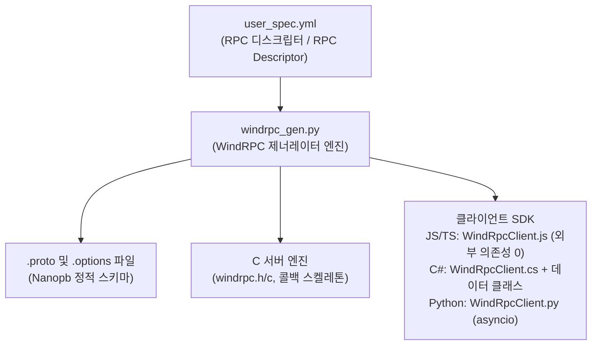
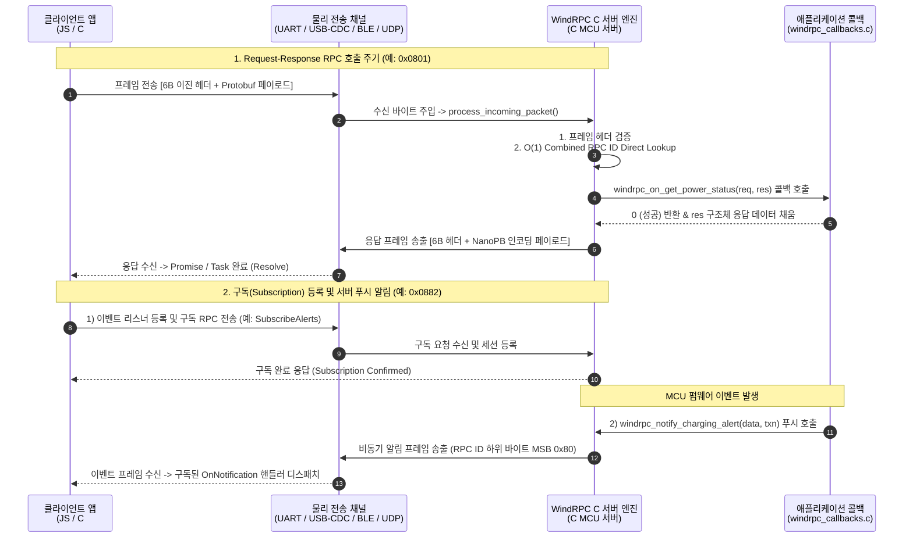

# WindRPC

[English](README.md) | [한국어](README.KR.md)

> Micro Interconnect & Network Dispatch
> _(마이크로시스템의 'M'을 180° 뒤집어 'W'로 명명)_

WindRPC는 마이크로시스템 환경을 위해 설계된 경량 RPC 프레임워크입니다.

Protocol Buffers(Protobuf)와 NanoPB를 기반으로 마이크로컨트롤러(MCU)와 상위 애플리케이션(C#, JS/TS 등) 간의 원격 프로시저 호출(RPC)을 지원하며, 소형 임베디드 환경에서 효율적으로 사용하기 위해 설계되었습니다.

---

## Key Features

1. 단일 YAML 기반 RPC 디스크립터 (RPC Descriptor)
   - 수동으로 `.proto` 파일이나 헤더를 작성할 필요 없이, 단 하나의 YAML 명세서(`user_spec.yml`)로 메시지 구조와 RPC 인터페이스를 정의합니다.
   - 외부 프로토 파일 `import` 의존성이 없는 완전 자립형(Self-contained) 설계로 복잡한 인클루드 설정 없이 단일 명세서로 빌드를 완결합니다.

2. 서버 & 멀티 언어 클라이언트 풀 코드 자동 생성 (Full-Code Generation)
   - Protobuf & NanoPB 파일 자동 생성: `.proto` 스키마 및 마이크로컨트롤러용 정적 옵션(`.options`) 파일 자동 출력.
   - C 서버 코드 자동 생성: 16비트 Combined RPC ID(`(service_id << 8) | rpc_id`) 기반 $O(1)$ Direct Lookup 디스패처 및 C 서버 스켈레톤 코드 자동 생성 (개발자는 애플리케이션 콜백 함수만 구현).
   - 멀티 언어 클라이언트 SDK 자동 생성: C#(`TaskCompletionSource` 기반 비동기 API), JS/TS(`Promise` 기반 비동기 API) 및 Python(`asyncio` 기반 비동기 API) 클라이언트 SDK 풀 코드를 자동 생성합니다.

---

## 시스템 아키텍처 및 동작 흐름 (System Architecture & Operational Workflow)

WindRPC는 빌드 타임 코드 생성 (Build-time Generation)과 실행 시간 패킷 디스패치 (Runtime Packet Dispatch)의 2단계로 동작합니다.

### 1. 빌드 타임 코드 생성 흐름 (Build-time Generation Flow)



### 2. 실행 시간 통신 및 디스패치 흐름 (Runtime Communication & Dispatch Flow)



---

## 프레임 바이너리 구조 (Frame Binary Format)

WindRPC는 메시지 전체를 Protobuf 감싸기 구조(Envelope)로 재귀 디코딩하지 않고, 6바이트의 고정 이진 헤더와 Protobuf 페이로드를 결합하여 송수신합니다:

```text
+-------------------+-------------------+-------------------+--------------------------------+
|  RPC_ID (2 Bytes) |  SEQ_ID (2 Bytes) | PAYLOAD_LEN (2B)  |   PAYLOAD (Protobuf 바이너리)  |
+-------------------+-------------------+-------------------+--------------------------------+
|     0x03 0x07     |     0x01 0x00     |    0x00 0x02      | [NanoPB로 인코딩된 데이터 바이트] |
+-------------------+-------------------+-------------------+--------------------------------+
  |<---------------- 6바이트 고정 이진 헤더 (Raw Binary, Little-Endian) ------------->|
```

- 6바이트 이진 헤더 (Non-Protobuf, Little-Endian):
  - `RPC_ID` (2B): `(service_id << 8) | rpc_id` (예: Service 7, RPC 3 -> `0x0703` -> LSB 우선 `0x03 0x07`)
  - `SEQ_ID` (2B): 시퀀스 / 트랜잭션 ID (Little-Endian `uint16_t`)
  - `PAYLOAD_LEN` (2B): 페이로드 데이터 바이트 길이 (Little-Endian `uint16_t`, 최대 65,535바이트 지원)
- 페이로드 (Protobuf Binary):
  - 명세서에 정의된 데이터 구조체(예: `PowerStatus`, `WifiConfig` 등)를 NanoPB/Protobuf로 직렬화한 데이터

> ARM Cortex-M 및 BLE 바이트 순서와 동일한 6바이트 리틀엔디안 헤더를 $O(1)$ 정수 연산(또는 포인터 캐스팅)으로 바로 파싱한 후, 타겟 메시지의 Protobuf 페이로드만 정적 메모리로 직접 역직렬화하므로 감싸기 디코딩 오버헤드와 NanoPB 콜백 의존성이 완전히 제거됩니다.

### 프레이밍(COBS) 및 무결성 검증(CRC) 관련

WindRPC는 프로토콜 수준에서 무겁거나 특정 전송 채널(Transport)에 종속되는 무결성 검증이나 프레이밍을 강제하지 않습니다. 전송 채널의 물리적 신뢰성에 따라 개발자가 필요한 부가 기능을 직접 선택하여 구성할 수 있습니다.

- 선택적 COBS 프레이밍 (UART, RS-485, USB-CDC 시리얼 스트림):
  패킷 경계(Frame Boundary) 구별이 필요한 연속 시리얼 바이트 스트림 통신 환경에서는 개발자가 선택적으로 COBS(Consistent Overhead Byte Stuffing) 알고리즘을 적용할 수 있습니다. 바이너리 데이터 내부의 `0x00` 바이트를 가변 포인터로 변환하여 패킷 끝에만 `0x00` 구분자(Delimiter)가 유일하게 위치하도록 구성됩니다.
- 선택적 CRC / 무결성 검증 (CRC16/CRC32, Checksum):
  노이즈가 심한 하드웨어 환경(예: 산업용 RS-485, 노이즈 환경의 UART)에서는 개발자가 패킷 테일에 CRC16/CRC32나 Checksum을 선택적으로 덧붙여 무결성을 검증할 수 있습니다. 이미 체크섬이 내장된 BLE, TCP, USB-CDC 채널에서는 CRC를 생략하여 오버헤드를 극단적으로 줄입니다.
- Raw 바이너리 직결 (UDP Datagram, BLE, TCP, Shared Memory):
  패킷 경계와 데이터 무결성이 이미 전송 레이어에서 보장되는 환경에서는 COBS 및 CRC 오버헤드 없이 6바이트 이진 헤더 패킷 그대로 빠르게 전송할 수 있습니다 (`buildRawFrame` / `receiveRawDatagram`).
- 클라이언트 내장 COBS 유틸리티: C# 및 JS/TS 클라이언트 SDK 내부에는 COBS 모듈이 내장 내포되어 있어, RPC 프레임 생성 외에도 커스텀 시리얼 통신 개발 시 독립 유틸리티로 선택하여 호출할 수 있습니다.
  - JS/TS: `import { cobsEncode, cobsDecode } from './WindRpcClient.js'` 또는 `WindRpcClient.cobsEncode(bytes)`
  - C#: `WindRpcClient.CobsEncode(bytes)` 또는 `Cobs.Encode(bytes)`

---

## 아키텍처 히스토리 (Historical Architecture Notes)

1. 초기 중첩 구조 (Nested Envelope Mode):
   - 개발 초기에는 클라이언트에서 Protobuf 메시지만으로 C 함수명을 직관적으로 알아볼 수 있도록 계층형 감싸기(`ClientMessage` -> `Request` -> `Service` -> `Command`) 구조를 검토했습니다.
   - 하지만 서버 디스패처는 물론 C#, JS/TS 클라이언트 SDK까지 풀 코드 자동 생성(Full-Code Generation)을 지원하게 되면서, 개발자가 Protobuf 메시지를 직접 다룰 필요가 없어졌습니다. 결과적으로 `.proto` 사양 자체를 사람이 읽기 좋은(Readable) 중첩 구조로 만드는 것은 MCU의 RAM/Flash 메모리와 C 스택 소비 측면에서 불필요한 비효율을 만든다고 판단했습니다.

2. 현재 정식 규격:
   - 6바이트 고정 이진 헤더(`RPC_ID[2] + SEQ_ID[2] + PAYLOAD_LEN[2]`, Little-Endian)와 Protobuf 페이로드를 직접 연결한 규격입니다.
   - 불필요한 계층 구조 디코딩을 없애고 16비트 Combined RPC ID(`(service_id << 8) | rpc_id`)로 $O(1)$ Direct Lookup 디스패치를 수행하여, NanoPB 콜백 의존성을 제거하고 실행 속도와 메모리 풋프린트를 최적화했습니다.

---

## Arm Cortex-M 메모리 풋프린트 추정 (Base Memory Footprint)

사용자 사양서(`user_spec.yml`) 메시지를 제외한 WindRPC 코어 C 서버 엔진 및 NanoPB 런타임의 Arm Cortex-M (M0+/M3/M4/M33, GCC `-Os` 최적화 기준) 추정 메모리 점유량입니다.

| 구분                                             | ROM (Flash)          | RAM (SRAM)         | 설명                                                           |
| :----------------------------------------------- | :------------------- | :----------------- | :------------------------------------------------------------- |
| NanoPB 코어 엔진 (`pb_encode/decode/common`) | ~2.5 KB – 3.5 KB     | 0 B                | 인코딩/디코딩 시 힙 할당 없이 C 호출 스택(Stack)만 활용        |
| WindRPC 코어 엔진 (`windrpc.c`)              | ~1.5 KB – 2.5 KB     | ~100 B             | 16비트 Combined ID$O(1)$ Direct Lookup 디스패치 및 코어 서비스 |
| 통신 프레임 버퍼 (Frame Buffer)              | 0 B                  | ~128 B – 512 B     | 사용자 설정 송수신 버퍼 (In-place / Double Buffer 선택)        |
| 합계 (Base Core Total)                       | ~4.0 KB – 6.0 KB | ~100 B (+버퍼) | Flash 16KB / RAM 4KB 급 초소형 MCU에서도 안정 구동             |

> In-place 버퍼 모드 (`WINDRPC_USE_INPLACE_BUFFER = 1`) 사용 시 유의 사항:
> In-place 모드는 극소 RAM MCU 환경을 위해 수신(RX)과 송신(TX) 버퍼 메모리를 공유(Single Shared Buffer)하는 모드입니다:
>
> 1. 요청 데이터 덮어쓰기 위험 (Overwrite Hazard): C 서버 콜백 내에서 응답 구조체(`res`)를 채울 때, 요청 구조체(`req`)의 `string`/`bytes` 포인터를 응답 구조체에 Shallow Copy (직접 포인터 할당) 하지 마십시오. 응답 직렬화 도중 수신 버퍼 메모리가 덮어씌워져 데이터 오염이 발생할 수 있으므로 반드시 Deep Copy (`memcpy`/`strncpy`) 하거나 로컬 변수에 복사해두어야 합니다.
> 2. 반이중(Half-Duplex) 통신 한정: 요청 수신 처리 응답 송신이 순차적으로 진행되는 반이중 환경(UART, RS-485)에 적합합니다.
> 3. 비동기 알림(Notification) 동시성 주의: 응답 생성 도중 다른 스레드/인터럽트에서 `windrpc_notify_*`를 호출하여 버퍼를 동시 사용할 경우 충돌이 발생하므로 Mutex나 단일 작업 큐(Work Queue) 처리가 필요합니다.

---

## 설치 (Installation)

WindRPC CLI 도구는 Git 저장소를 통해 직접 설치할 수 있습니다:

```bash
# Git 레포지토리 직접 설치
pip install git+https://github.com/micro-artwork/windrpc.git

# 또는 레포지토리 클론 후 로컬 개발 모드 설치
git clone https://github.com/micro-artwork/windrpc.git
cd windrpc
pip install -e .
```

---

## Quick Start

### 1. YAML 기반 RPC 명세서 작성 (`user_spec.yml`)

WindRPC는 복잡한 `.proto` 파일 수동 작성 대신 단일 YAML 기반 RPC 디스크립터(RPC Descriptor)를 사용합니다.

> [!NOTE]
> `user_spec.yml`은 문서 안내용 대표 예시 파일명입니다. 실제 프로젝트 구동 시에는 `bitnari_spec.yml`, `my_app.yaml` 등 임의의 원하는 파일명으로 지정하여 작성한 후 CLI 실행 시 `-s` (`--user-spec`) 옵션의 경로 인자로 전달하시면 됩니다.

- `package`: 서비스 및 메시지의 루트 패키지/네임스페이스 식별자
- `config`: 프로젝트 전역 설정
- `services`: RPC 서비스 정의 목록 (서비스별 고유 `id` > 6 및 `name`)
  - `messages`: 데이터 구조체 정의 (필드 번호, 타입, NanoPB 정적 메모리 제약 옵션 `max_count`, `max_length` 등)
  - `rpcs`: 원격 메서드 정의 (`id`, `name`, `type`, `command`/`result`)

> 마이크로시스템 서버 안정성을 위한 정적 메모리(Static Memory) 설계 원칙
>
> - 정적 메모리 우선 사양: 마이크로컨트롤러(MCU) 환경에서 동적 메모리 할당(`malloc`/`free`)은 장기 구동 시 메모리 파편화(Fragmentation) 및 힙 고갈을 유발합니다. WindRPC는 서버 구동의 예측 가능성과 안정성을 보장하기 위해 힙 할당을 배제하고 100% 정적 메모리 사양(Static Memory Allocation)을 최우선하여 설계되었습니다.
> - 옵션 미지정 시 자동 기본값: 명세서에서 `nanopb:` 정적 메모리 옵션을 생략하더라도 콜백 함수로 빠지지 않도록 자동 기본값(`string`: 64B, `bytes`: 64B, `repeated`: 16개)이 부여됩니다. (프로젝트 전역 기본값은 `config:` 섹션에서 변경 가능)
> - 적절한 최대 크기 결정 권장: RAM 사용을 최적화하고 버퍼 오버플로우를 방지하기 위해, 시스템 특성에 맞춰 각 가변 필드(`string`, `bytes`, `repeated`)의 적절한 최대 데이터 크기(`max_length` / `max_count`)를 명시적으로 결정하여 지정하는 것을 강력히 권장합니다.

```yaml
package: my_project

services:
  # 서비스 ID 1~6번은 WindRPC 코어 시스템 예약 구간입니다.
  - id: 7
    name: led_control
    messages:
      - name: PixelData
        fields:
          - number: 1
            name: colors
            type: uint32
            property: repeated
            nanopb: { max_count: 64 } # 정적 최대 배열 개수 지정 (64개)
    rpcs:
      - id: 1
        name: display_pixels
        type: REQUEST_ONLY
        command: PixelData

  - id: 8
    name: power_manager
    messages:
      - name: PowerStatus
        fields:
          - { number: 1, name: voltage_mv, type: uint32 }
          - { number: 2, name: is_charging, type: bool }
    rpcs:
      - id: 1
        name: get_power_status
        type: REQUEST_RESPONSE
        command: types.Empty
        result: PowerStatus
```

### 2. 코드 제너레이터 실행 (`windrpc` CLI)

WindRPC는 YAML 디스크립터로부터 Protobuf 파일만 독립적으로 생성하거나, 서버 및 클라이언트 SDK 코드를 원스톱으로 생성할 수 있습니다.

> [!NOTE]
> `windrpc server` 또는 `windrpc client` 명령 실행 시 필요한 `.proto` 스키마 및 NanoPB 옵션(`.options`) 파일이 내부적으로 함께 자동 생성됩니다.

```bash
# 1. Protobuf 파일(.proto, .options)만 독립 생성
windrpc proto -s user_spec.yml -o protos

# 2. C 서버 코드 생성 (내부적으로 .proto 생성 포함)
windrpc server -s user_spec.yml -o server

# 3. C# / JS / Python 클라이언트 SDK 생성 (내부적으로 .proto 생성 포함)
windrpc client -s user_spec.yml -o client/csharp -l csharp
windrpc client -s user_spec.yml -o client/js -l js
windrpc client -s user_spec.yml -o client/python -l python
```

### 3. 코드 활용 예시

C 서버 (마이크로컨트롤러):

```c
int32_t windrpc_on_get_power_status(const void *req, rpc_power_manager_PowerStatus_t *res, void *context) {
    res->voltage_mv = 5000; // 5V
    res->is_charging = true;
    return 0; // OK
}
```

C# 클라이언트:

```csharp
var client = new WindRpcClient(data => serialPort.Write(data, 0, data.Length));
var status = await client.PowerManager.GetPowerStatusAsync();
Console.WriteLine($"Voltage: {status.VoltageMv} mV");
```

Python 클라이언트:

```python
client = WindRpcClient()
frame = await client.send_request_async(RPC_POWER_MANAGER_GET_POWER_STATUS, b"", transport_send)
status = power_manager_pb2.PowerStatus()
status.ParseFromString(frame.payload)
print(f"Voltage: {status.voltage_mv} mV")
```

---

## ️ Zephyr RTOS 연동 및 빌드 설정 가이드 (CMake & Kconfig)

WindRPC로 생성된 서버 코드와 Protobuf 파일들을 Zephyr RTOS 프로젝트에 포함하여 컴파일하는 방법입니다.

### 1. `prj.conf` 설정

Nanopb 모듈 및 빌드 옵션을 활성화합니다:

```ini
# Nanopb 활성화
CONFIG_NANOPB=y
CONFIG_NANOPB_WITHOUT_64BIT=y

# (선택) 시리얼/UART 통신용 COBS 프레이밍 사용 시
CONFIG_COBS=y
```

### 2. `CMakeLists.txt` 설정

Zephyr 프로젝트의 `CMakeLists.txt` 파일에 Nanopb 모듈 로드, 생성된 `.proto` 파일 컴파일, 그리고 WindRPC C 서버 소스를 빌드 타겟(`app`)에 추가합니다:

```cmake
if (CONFIG_NANOPB)
  # 1) Zephyr Nanopb CMake 모듈 포함 list(APPEND CMAKE_MODULE_PATH ${ZEPHYR_BASE}/modules/nanopb)
  include(nanopb)

  # 2) WindRPC로 생성된 .proto 파일 컴파일 (Nanopb C 코드 자동 생성)
  zephyr_nanopb_sources(app RELPATH protos protos/<package_name>/windrpc/types/types.proto
					   protos/<package_name>/windrpc/service/common.proto
					   protos/<package_name>/windrpc/service/<your_service>.proto
					   protos/<package_name>/windrpc/core/windrpc.proto)

  # 3) WindRPC C 서버 소스 및 헤더 경로 등록
  include_directories(src/windrpc)
  target_sources(app PRIVATE src/windrpc/windrpc.c
			     src/windrpc/windrpc_callbacks.c
			     src/windrpc/windrpc_notify.c)
endif()
```

---

## 문서 안내 (Documentation Roadmap)

상세한 개발 가이드 및 통합 아키텍처 명세는 `docs/` 폴더 내의 단일 통합 레퍼런스 문서를 참고하시기 바랍니다:

- [windrpc_manual.KR.md](file:///s:/repos/windrpc/docs/windrpc_manual.KR.md): 사양서 작성 가이드, 6바이트 이진 헤더 메커니즘, C 서버 엔진 콜백 및 클라이언트 SDK(JS/TS, C#) 연동 가이드를 포함하는 통합 한글 레퍼런스 매뉴얼

---

## Contribution 안내

WindRPC는 현재 리뷰를 하거나 유지보수를 할 수 있는 여력이 제한되어 외부 기여(PR, Issue) 수용이 어려운 상태입니다.

- Pull Request: 사전 협의 없는 PR은 별도 리뷰 없이 자동 거절 또는 종료될 수 있습니다.
- 향후 오픈 계획: 기여 허용 시점은 미정이며, 추후 프로젝트가 범용 오픈소스로서 가치와 기여 체계를 충분히 갖추었을 때 고려해보겠습니다. 양해 부탁드립니다.

---

## License

This project is released under the [MIT License](LICENSE).
