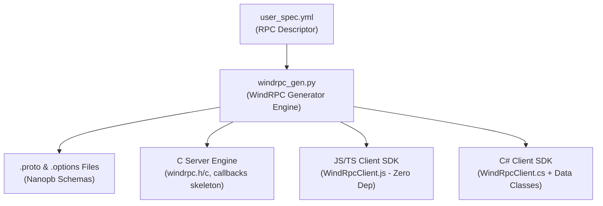
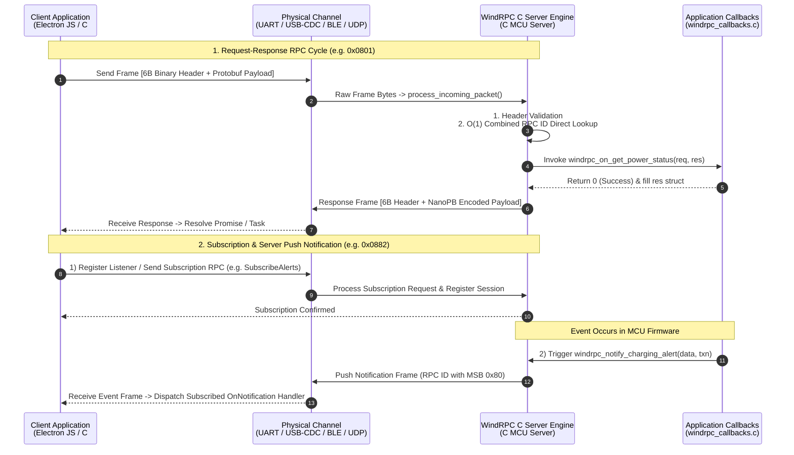

# WindRPC

[English](README.md) | [한국어](README.KR.md)

> Micro Interconnect & Network Dispatch
> _(Named by inverting 'M' of Microsystems into 'W')_

WindRPC is a lightweight RPC framework designed for micro systems.

Built upon Protocol Buffers and NanoPB, WindRPC enables Remote Procedure Calls (RPC) between microcontrollers (MCUs) and high-level applications (C#, JS/TS), specifically designed for small embedded environments.

---

## Key Features

1. Single YAML-based RPC Descriptor
   - Define all message structures and RPC interfaces in a single YAML specification file (`user_spec.yml`) without manually writing `.proto` files or C headers.
   - Self-contained design with zero external `import` dependencies, enabling compilation without complex include path configurations.

2. Full-Code Generation (Server & Multi-Language Clients)
   - Protobuf & NanoPB Generation: Automatically generates `.proto` schemas and Nanopb static memory option files (`.options`).
   - C Server Code Generation: Automatically generates C server dispatchers with $O(1)$ direct lookup (`(service_id << 8) | rpc_id`) and callback skeletons for embedded C MCUs (developers only implement business logic callbacks).
   - Multi-Language Client SDKs: Automatically generates full-code C# (Async `Task` based), JavaScript/TypeScript (Async `Promise` based), and Python (Async `asyncio` based) client SDKs.

---

## System Architecture & Operational Workflow

WindRPC operates across two phases: Build-time Code Generation (from a single YAML specification) and Runtime Packet Dispatch (zero-heap binary frame processing).

### 1. Build-time Code Generation Flow



### 2. Runtime Communication & Dispatch Flow



---

## Frame Binary Format

WindRPC avoids recursive Protobuf envelope decoding. Instead, it pairs a 6-byte fixed raw binary header (Little-Endian) directly with a Protobuf payload:

```text
+-------------------+-------------------+-------------------+--------------------------------+
|  RPC_ID (2 Bytes) |  SEQ_ID (2 Bytes) | PAYLOAD_LEN (2B)  |   PAYLOAD (Protobuf Binary)    |
+-------------------+-------------------+-------------------+--------------------------------+
|     0x03 0x07     |     0x01 0x00     |    0x00 0x02      |  [NanoPB-encoded Data Bytes]   |
+-------------------+-------------------+-------------------+--------------------------------+
  |<-------------- 6-Byte Fixed Raw Binary Header (Little-Endian) ------------->|
```

- 6-Byte Fixed Binary Header (Non-Protobuf, Little-Endian):
  - `RPC_ID` (2B): `(service_id << 8) | rpc_id` (e.g. Service 7, RPC 3 -> `0x0703` -> LSB first `0x03 0x07`)
  - `SEQ_ID` (2B): Request sequence counter (e.g. 1 -> `0x0001` -> LSB first `0x01 0x00`)
  - `PAYLOAD_LEN` (2B): Payload byte length (e.g. 2 -> `0x0002` -> LSB first `0x02 0x00`)
- Protobuf Binary Payload:
  - Raw binary payload data serialized via NanoPB/Protobuf for user-defined structs (e.g. `PowerStatus`, `WifiConfig`)

> Pairing a 6-byte Little-Endian raw binary header (matching native ARM Cortex-M endianness) directly with a Protobuf payload eliminates outer Protobuf envelope parsing and reduces NanoPB callback overhead to zero.

### Optional Transport Features: Framing (COBS) & Integrity Verification (CRC)

WindRPC does not force a heavy, transport-specific protocol wrapper. Developers have complete freedom to choose optional transport features based on the physical channel reliability:

- Optional COBS Framing (UART, RS-485, USB-CDC Serial Streams):
  For continuous serial streams where packet boundaries must be identified, developers can optionally wrap frames with COBS (Consistent Overhead Byte Stuffing) (`buildCobsFrame` / `receiveBytes`). COBS guarantees that `0x00` only appears at the end of each packet as a frame delimiter.
- Optional CRC / Checksum Verification (CRC16/CRC32, Checksum):
  In noisy hardware environments (e.g. industrial RS-485 or long UART lines), developers may optionally append a CRC16/CRC32 checksum to the packet tail. For reliable transports with native checksums (BLE, TCP, USB-CDC), CRC is omitted to eliminate unnecessary processing overhead.
- Raw Binary Direct Transport (UDP Datagrams, BLE, TCP, Shared Memory):
  For transports that already ensure message framing and integrity natively, raw 6-byte binary header packets can be transmitted directly without any COBS or CRC overhead (`buildRawFrame` / `receiveRawDatagram`).
- Embedded Standalone COBS Utilities: Auto-generated C# and JS/TS client SDKs include built-in COBS utilities exposed directly for optional standalone use in custom serial workflows:
  - JS/TS: `import { cobsEncode, cobsDecode } from './WindRpcClient.js'` or `WindRpcClient.cobsEncode(bytes)`
  - C#: `WindRpcClient.CobsEncode(bytes)` or `Cobs.Encode(bytes)`

---

## Historical Architecture Notes

WindRPC evolved through key design iterations to achieve optimal microcontroller performance:

1. Initial Concept (Nested Envelope Mode):
   - In early framework iterations, WindRPC explored nesting messages inside a multi-level Protobuf envelope structure (`ClientMessage` -> `Request` -> `Service` -> `Command`), which allowed developers constructing raw Protobuf payloads manually to intuitively match message names to RPC methods.
   - However, as WindRPC transitioned to a Full-Code Generation policy (auto-generating full C server dispatchers and idiomatic C#, JS/TS client SDKs), manual Protobuf message crafting was eliminated. Making `.proto` schemas human-readable at the expense of high NanoPB callback overhead and heavy MCU stack usage proved to be an inefficient trade-off.

2. Current Official Standard:
   - WindRPC pairs a 6-byte Little-Endian fixed raw binary header (`RPC_ID[2] + SEQ_ID[2] + PAYLOAD_LEN[2]`) directly with a Protobuf payload.
   - Outer Protobuf envelope parsing is eliminated. Routing is executed via a 16-bit combined RPC ID (`(service_id << 8) | rpc_id`) using an $O(1)$ direct lookup array, achieving maximum execution speed with minimal RAM/Flash footprint and zero callback overhead.

> Microcontrollers parse the 6-byte Little-Endian header in $O(1)$ integer operations, matching ARM Cortex-M native byte order and BLE GATT conventions.

---

## Arm Cortex-M Base Memory Footprint Estimate

Estimated memory consumption of the WindRPC Core C Server Engine and NanoPB Runtime (excluding user application messages in `user_spec.yml`) on Arm Cortex-M microcontrollers (M0+/M3/M4/M33 with GCC `-Os` optimization):

| Component                                          | ROM (Flash)          | RAM (SRAM)           | Description                                                            |
| :------------------------------------------------- | :------------------- | :------------------- | :--------------------------------------------------------------------- |
| NanoPB Core Engine (`pb_encode/decode/common`) | ~2.5 KB – 3.5 KB     | 0 B                  | Zero runtime heap usage; uses C call stack during encoding/decoding    |
| WindRPC Core Engine (`windrpc.c`)              | ~1.5 KB – 2.5 KB     | ~100 B               | 16-bit Combined ID$O(1)$ Direct Lookup Dispatcher & Core Services      |
| Frame Transport Buffer                         | 0 B                  | ~128 B – 512 B       | User-configurable RX/TX buffer (In-place or Double Buffer)             |
| Base Core Total                                | ~4.0 KB – 6.0 KB | ~100 B (+Buffer) | Operates reliably even on ultra-small MCUs (e.g. 16KB Flash / 4KB RAM) |

> Important Caveats when using In-place Buffer Mode (`WINDRPC_USE_INPLACE_BUFFER = 1`):
> In-place mode uses a single shared buffer for both RX and TX to minimize RAM consumption on ultra-small MCUs:
>
> 1. Request Payload Overwrite Hazard: In your C server callback, do NOT assign pointers (shallow copy) from the request message (`req`) string/bytes fields to the response message (`res`). When encoding the response, the RX buffer memory is overwritten, leading to data corruption. Always perform a Deep Copy (`memcpy`/`strncpy`) or copy request parameters to local variables before preparing the response.
> 2. Half-Duplex Transports Only: Intended strictly for half-duplex, synchronous request-response execution (UART, RS-485).
> 3. Asynchronous Notification Concurrency Warning: Do not trigger `windrpc_notify_*` calls from interrupts or other threads while a request-response cycle is encoding. Ensure sequential execution using Mutexes or a single OS WorkQueue.

---

## Installation

WindRPC CLI tool can be installed directly from the Git repository:

```bash
# Direct installation from Git repository
pip install git+https://github.com/windrpc/windrpc.git

# Or clone the repository and install in editable mode
git clone https://github.com/windrpc/windrpc.git
cd windrpc
pip install -e .
```

---

## YAML-based RPC Specification (`user_spec.yml`)

WindRPC uses a single YAML-based RPC Descriptor for your project, eliminating the need to manually write complex `.proto` files.

> [!NOTE]
> `user_spec.yml` is used as an example filename throughout the documentation. You can name your specification file anything you prefer (e.g. `bitnari_spec.yml`, `my_app.yaml`) and pass its path to the CLI via the `-s` / `--user-spec` parameter.

- `package`: Root package identifier for namespace and Protobuf schema
- `config`: Project configuration settings
- `services`: List of RPC services, each with a unique `id` (> 6) and `name`
  - `messages`: Message structures (field tags, scalar/message types, and Nanopb memory constraint options like `max_count`, `max_length`)
  - `rpcs`: RPC method definitions (`id`, `name`, `type`, `command`/`result`)
    - `REQUEST_RESPONSE`: Standard request-response RPC (Command -> Result)
    - `REQUEST_ONLY`: One-way fire-and-forget command (Command -> None)
    - `NOTIFICATION`: Asynchronous server push event notification (Event)

> Static Memory Architecture for Embedded Server Stability
>
> - Static Allocation Priority: In microcontroller (MCU) environments, dynamic memory allocation (`malloc`/`free`) leads to memory fragmentation and heap exhaustion over extended runtimes, causing server instability. To maximize server reliability and predictability, WindRPC prioritizes 100% Static Memory Allocation (zero runtime heap usage) by design.
> - Automatic Fallbacks when Omitted: Even if `nanopb:` memory options are omitted in the YAML spec, WindRPC automatically assigns conservative static fallbacks (`string`: 64B, `bytes`: 64B, `repeated`: 16 items) instead of falling back to dynamic NanoPB callbacks. (Configurable globally via `config:`).
> - Explicit Max Size Recommendation: To optimize RAM usage and prevent buffer overflows, developers are strongly encouraged to analyze their application domain and explicitly define appropriate maximum bounds (`max_length` / `max_count`) for each variable-length field.

```yaml
package: my_project

services:
  # Service IDs 1 to 6 are reserved for WindRPC core services
  - id: 7
    name: led_control
    messages:
      - name: PixelData
        fields:
          - number: 1
            name: colors
            type: uint32
            property: repeated
            nanopb: { max_count: 64 }
    rpcs:
      - id: 1
        name: display_pixels
        type: REQUEST_ONLY
        command: PixelData

  - id: 8
    name: power_manager
    messages:
      - name: PowerStatus
        fields:
          - { number: 1, name: voltage_mv, type: uint32 }
          - { number: 2, name: is_charging, type: bool }
    rpcs:
      - id: 1
        name: get_power_status
        type: REQUEST_RESPONSE
        command: types.Empty
        result: PowerStatus

      - id: 2
        name: charging_alert
        type: NOTIFICATION
        event: PowerStatus
```

---

## CLI Usage (`windrpc`)

WindRPC can generate standalone Protobuf files independently, or generate complete server/client SDK code in a single command.

> [!NOTE]
> Running `windrpc server` or `windrpc client` automatically generates all required `.proto` schemas and Nanopb `.options` files internally as part of the pipeline.

### 1. Standalone Protobuf (`.proto`, `.options`) Code Generation

```bash
windrpc proto -s user_spec.yml -o protos
```

### 2. RPC Server C Code Generation (Includes `.proto` generation)

```bash
windrpc server -s user_spec.yml -o server
```

### 3. RPC Client SDK Code Generation (Includes `.proto` generation)

```bash
# C# Client Generation
windrpc client -s user_spec.yml -o client/csharp -l csharp

# JS/TS Client Generation
windrpc client -s user_spec.yml -o client/js -l js

# Python Client Generation
windrpc client -s user_spec.yml -o client/python -l python
```

---

## ️ Zephyr RTOS Integration Guide (CMake & Kconfig)

How to configure `prj.conf` and `CMakeLists.txt` when integrating generated WindRPC server code and Protobuf files into a Zephyr RTOS project.

### 1. `prj.conf` Configuration

Enable Nanopb and build options:

```ini
# Enable Nanopb
CONFIG_NANOPB=y
CONFIG_NANOPB_WITHOUT_64BIT=y

# (Optional) COBS framing for serial/UART transports
CONFIG_COBS=y
```

### 2. `CMakeLists.txt` Configuration

In your Zephyr project's `CMakeLists.txt`, include the Nanopb CMake module, compile the generated `.proto` files into Nanopb C code, and link the WindRPC C server sources to your `app` target:

```cmake
if (CONFIG_NANOPB)
  # 1) Include Zephyr Nanopb CMake module list(APPEND CMAKE_MODULE_PATH ${ZEPHYR_BASE}/modules/nanopb)
  include(nanopb)

  # 2) Compile generated .proto files with Nanopb generator
  zephyr_nanopb_sources(app RELPATH protos protos/<package_name>/windrpc/types/types.proto
					   protos/<package_name>/windrpc/service/common.proto
					   protos/<package_name>/windrpc/service/<your_service>.proto
					   protos/<package_name>/windrpc/core/windrpc.proto)

  # 3) Include WindRPC C server sources and include directories
  include_directories(src/windrpc)
  target_sources(app PRIVATE src/windrpc/windrpc.c
			     src/windrpc/windrpc_callbacks.c
			     src/windrpc/windrpc_notify.c)
endif()
```

---

## Documentation

For comprehensive framework specifications and developer guides, refer to the unified reference manual:

- [windrpc_manual.md](file:///s:/repos/windrpc/docs/windrpc_manual.md): Comprehensive reference manual covering specification authoring, 6-byte binary header mechanics, C server engine callbacks, and client SDK integration (JS/TS & C#).

---

## Contributing Notice

WindRPC currently has limited maintainer availability for external code reviews or PR processing.

- Pull Requests: Unsolicited PRs may be automatically closed without review.
- Future Open Roadmap: The timeline for accepting external contributions is TBD. We plan to open public contributions when the project matures into a broader community-focused framework. Thank you for your understanding.

---

## License

This project is released under the [MIT License](LICENSE).
